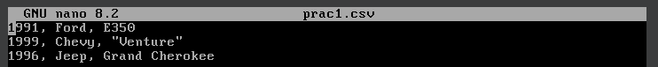
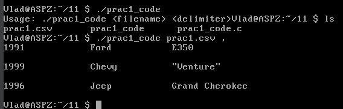

# Завдання 1.20

## Умова
Створіть функцію, яка приймає вхідний файл у форматі CSV та виводить його вміст у вигляді відформатованої таблиці. Додайте підтримку різних роздільників, таких як кома, крапка з комою або табуляція.

## Код

```c
#include "stdio.h"
#include "stdlib.h"
#include "string.h"

#define MAX_LINE 1024
#define MAX_COLUMNS 100

void print_table(const char *filename, char delimiter){
    FILE *file = fopen(filename, "r");
    if (!file) {
        perror("Error opening file");
        return;
    }

    char line[MAX_LINE];
    while (fgets(line, sizeof(line), file)) {
        char *columns[MAX_COLUMNS];
        int col_count = 0;

        char *token = strtok(line, &delimiter);
        while (token && col_count < MAX_COLUMNS) {
            columns[col_count++] = token;
            token = strtok(NULL, &delimiter);
        }

        for (int i = 0; i < col_count; i++) {
            printf("%-15s", columns[i]);
        }
        printf("\n");
    }
    fclose(file);
}

int main(int argc, char *argv[]) {
    if (argc != 3) {
        printf("Usage: %s <filename> <delimiter>\n", argv[0]);
        return 1;
    }

    char delimiter = argv[2][0];
    print_table(argv[1], delimiter);
    return 0;
}
```

## Пояснення коду
Функція `print_table` відкриває вказаний користувачем файл та перевіряє, чи вдалося його відкрити. Якщо файл відсутній або не вдалося отримати доступ, програма виведе повідомлення про помилку. Далі файл читається построчно, і кожен рядок ділиться на стовпці згідно з вказаним роздільником. Для цього використовується функція `strtok`, яка поступово виділяє фрагменти тексту між роздільниками. Отримані значення зберігаються в масиві `columns`. Після обробки рядка всі отримані елементи виводяться у вигляді відформатованої таблиці, де кожне значення займає 15 символів у ширину для вирівнювання. Після обробки всіх рядків файл закривається.

Функція `main` перевіряє, чи були передані необхідні аргументи командного рядка: назва файлу та символ-роздільник. Якщо аргументів недостатньо, програма виводить підказку щодо правильного використання. Якщо все введено правильно, викликається `print_table`, яка виконує обробку та вивід таблиці.

## Вхідний файл CSV



## Результат роботи програми


