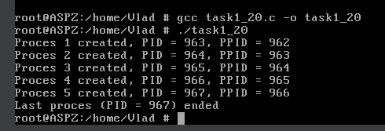

# Завдання 1 (варіант 20)

## Умова

Створіть дерево процесів, у якому кожен нащадок створює ще одного. Переконайтесь, що всі процеси завершуються правильно, навіть якщо батьківський процес завершується раніше.

## Виконання

### [Код програми](task1_20.c) 

### Пояснення

Програма використовує системний виклик `fork()`, який створює новий процес шляхом копіювання поточного. Якщо `fork()` виконується успішно, то він повертає 0 у дочірньому процесі, а в батьківському — ідентифікатор нового процесу (`PID`). Це дозволяє розрізняти, у якому саме процесі зараз виконується код.

В циклі кожен процес створює одного нащадка. Щоб уникнути cтворення зайвих процесів, батьківський процес після створення дитини чекає, поки вона завершиться, і сам завершенням закінчує свою роботу. Таким чином, у кожен момент часу лише один процес продовжує створювати наступного. Завдяки цьому формується ланцюг з `N` послідовно зв’язаних процесів (в прикладі 5), які не існують одночасно, а з’являються і завершуються один за одним. Це дозволяє уникнути накопичення великої кількості активних процесів і зомбі-процесів.

У результаті програма створює контрольовану структуру процесів, де кожен процес правильно завершується, навіть якщо батьківський процес завершується раніше, ніж його нащадок.

### Результат запуску програми

