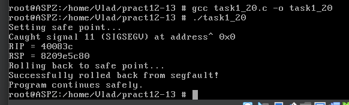

# Завдання 1 (варіант 20)

## Умова

Напишіть програму, що у випадку SIGSEGV намагається проаналізувати стек і визначити, чи можливо «відкотитися» на безпечну точку виконання.

## Виконання

### [Код програми](task1_20.c) 

### Пояснення

Ця програма демонструє, як можна перехопити помилку сегментації (сигнал `SIGSEGV`) і повернутися до безпечної точки виконання, замість того щоб аварійно завершити виконання. Для цього використовується механізм довгого переходу `sigsetjmp`/`siglongjmp`, який дозволяє зберегти контекст виконання і повернутися до нього пізніше. На початку програми за допомогою `sigsetjmp(jump_buffer, 1)` зберігається безпечна точка, до якої буде здійснено повернення у разі помилки. Після цього встановлюється обробник сигналу `SIGSEGV`, який буде викликано, якщо програма спробує звернутися до недоступної пам’яті. Далі навмисно викликається помилка: створюється нульовий вказівник (`NULL`) і відбувається спроба запису за цією адресою. Це спричиняє виникнення сигналу `SIGSEGV`, і керування передається обробнику.

У обробнику сигналу `segfault_handler` аналізується контекст процесора через структуру `ucontext_t`, з якої витягуються значення регістрів `RIP` (адреса інструкції, яка спричинила помилку) та `RSP` (адреса стеку). Це дозволяє визначити, де саме відбулася помилка, і чи є можливість продовжити виконання. Після цього викликається `siglongjmp(jump_buffer, 1)`, який переносить виконання назад у точку, збережену `sigsetjmp`. При повторному входженні в цю точку функція повертає вже не 0, а ненульове значення, і програма переходить до гілки, яка виконується після «відкату». Таким чином, програма не завершується аварійно, а відновлює контроль та продовжує виконання у безпечному стані. Це дозволяє реалізувати примітивний механізм захисту від фатальних помилок під час доступу до пам’яті.

### Результат запуску програми

