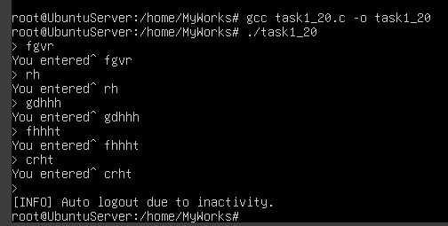

# Завдання 1 (варіант 20)

## Умова

Використовуйте таймери для реалізації автоматичного лог-ауту користувача у CLI-додатку після N хвилин бездіяльності.

## Виконання

### [Код програми](task1_20.c) 

### Пояснення

Ця програма реалізує механізм автоматичного виходу користувача з CLI-додатку після певного періоду бездіяльності, використовуючи старий, але досі ефективний механізм інтервального таймера `setitimer()`. На початку задається тривалість очікування без введення з клавіатури — 15 секунд (значення визначається макросом `TIMEOUT_MINUTES`). Далі встановлюється обробник сигналу `SIGALRM`, який викликається, коли таймер спрацьовує. У цьому обробнику виконується простий запис повідомлення до стандартного виводу (через `write`, оскільки він безпечний для використання в сигнал-хендлерах) і примусове завершення програми через `exit(0)`.

Кожного разу, коли користувач вводить рядок тексту, програма викликає функцію `reset_timer()`, яка оновлює таймер і відраховує нові 15 секунд до потенційного виходу. Це досягається через структуру `itimerval`, яка передається у функцію `setitimer()`. Поле `it_value` визначає час до наступного сигналу, а `it_interval` встановлюється в нуль, що означає, що таймер є одноразовим — він спрацює лише один раз, якщо його не скинути. У циклі `while (1)` програма чекає на введення від користувача, і якщо таке введення відбувається (через `fgets()`), таймер одразу скидається, тим самим відкладаючи автоматичний вихід.

Якщо користувач не введе нічого протягом 15 секунд, сигнал `SIGALRM` спрацює, і програма завершиться з повідомленням про неактивність.

### Результат запуску програми

