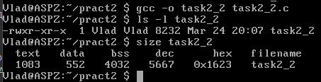
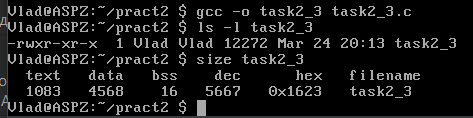
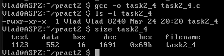
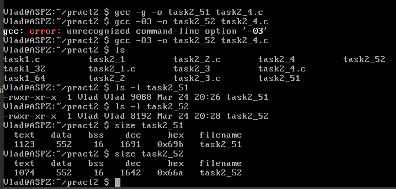
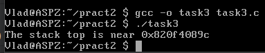
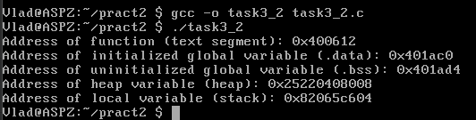
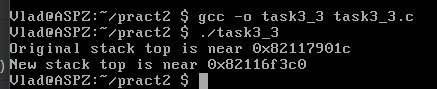
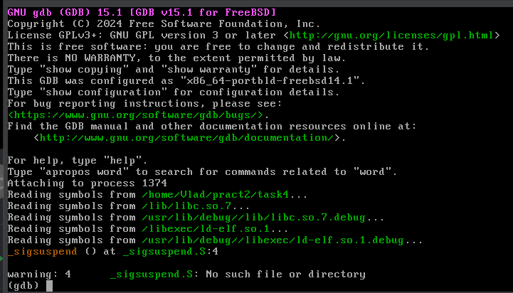
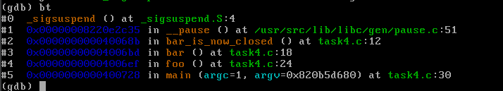
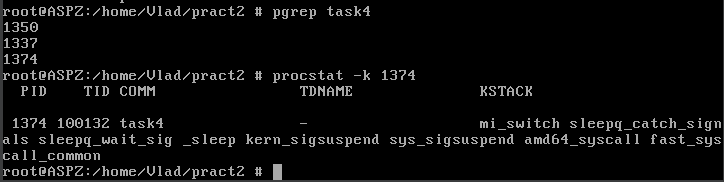

# Завдання 1

## Умова

Необхідно написати програму для визначення моменту, коли `time_t` закінчиться. Програма повинна досліджувати зміни в залежності від 32- та 64-бітної архітектури. Також потрібно дослідити сегменти виконуваного файлу.

## Код програми

```c
#include <stdio.h>
#include <time.h>
#include <limits.h>

int main() {
    // Визначення максимального значення time_t
    time_t max_time = (time_t)~((time_t)1 << (sizeof(time_t) * 8 - 1));
    printf("Максимальне значення time_t: %lld\n", (long long)max_time);
    
    // Перетворення в людський формат
    printf("Максимальна дата і час: %s", ctime(&max_time));

    // Визначення розміру time_t
    printf("Розмір time_t: %zu байт\n", sizeof(time_t));

    return 0;
}
```

## Пояснення

Програма визначає максимальне значення `time_t` за допомогою операцій з бітами, встановлюючи всі біти крім старшого на одиницю, що дозволяє визначити максимальну дату й час, яку може представляти тип `time_t`. Потім програма виводить це значення у людському форматі та показує розмір типу `time_t` у байтах.

## Результат виконання програми

Програма виводить максимальне значення `time_t` та відповідну дату й час для обраної архітектури. Для 64-бітної архітектури результат буде більший, оскільки тип `time_t` займає більше байтів.
Для компіляції програми в 32-бітному режимі використано тег `-m32`, а для 64-бітного — тег `-m64`. Це дозволяє компілювати програму під різні архітектури. Для аналізу сегментів виконуваного файлу використано команди.


## Аналіз сегментів

Для того аби проаналізувати сегменти програми було використано наступні команди:

```bash
readelf -l task1_64 | less
```

та

```bash
readelf -l task1_32 | less
```

Команда `readelf` є утилітою для перегляду інформації про виконувані файли в форматі ELF (Executable and Linkable Format), що використовується в операційних системах Unix-подібного типу (наприклад, Linux). Ключ `-l` вказує на те, що потрібно вивести заголовки сегментів виконуваного файлу.
Таким чином, команда `readelf -l` дозволяє отримати інформацію про те, як виконуваний файл організований і як його сегменти будуть оброблятися під час запуску.

Команда `less` дозволяє прокручувати виведене у консолі, що зручно для перегляду великих обсягів інформації.

## Результати аналізу

### 64-бітна архітектура

Вивід команди `readelf -l task1_64 | less`:


### 32-бітна архітектура

Вивід команди `readelf -l task1_32 | less`:


# Завдання 2.2

## Умова

Розгляньте сегменти у виконуваному файлі.

1. Скомпілюйте програму &quot;hello world&quot;, запустіть ls -l для виконуваного файлу, щоб отримати його загальний розмір, і запустіть size, щоб отримати розміри сегментів всередині нього.

2. Додайте оголошення глобального масиву із 1000 int, перекомпілюйте й повторіть вимірювання. Зверніть увагу на відмінності.

3. Тепер додайте початкове значення в оголошення масиву (пам’ятайте, що C не змушує вас вказувати значення для кожного елемента масиву в ініціалізаторі). Це перемістить масив із сегмента BSS у сегмент даних. Повторіть вимірювання. Зверніть увагу на різницю.

4. Тепер додайте оголошення великого масиву в локальну функцію. Оголосіть другий великий локальний масив з ініціалізатором. Повторіть вимірювання. Дані розташовуються всередині функцій, залишаючись у виконуваному файлі? Яка різниця, якщо масив ініціалізований чи ні?

5. Які зміни відбуваються з розмірами файлів і сегментів, якщо ви компілюєте для налагодження? Для максимальної оптимізації?

## Код до пункту 1

```c
#include <stdio.h>

int main() {
    printf("Hello, World!\n");
    return 0;
}
```

## Пояснення до пункту 1

За допомогою команд 

```bash
gcc -o task2_1 task2_1.c
ls -l task2_1        # Перевіряємо загальний розмір файлу
size task2_1         # Перевіряємо розмір сегментів
```

отримуємо загальний розмір і розміри сегментів всередині виконуваного файлу.


## Код до пункту 2

```c
#include <stdio.h>

int arr[1000];

int main() {
    printf("Hello, World!\n");
    return 0;
}
```

## Пояснення до пункту 2

Додали оголошення глобального масиву із 1000 int. 



Розмір файлу трохи збільшився. Також збільшилось `.bss`, адже в ньому тепер міститься створений масив. 
`.bss` - це частина пам'яті, що використовується для зберігання неініціалізованих глобальних та статичних змінних.

## Код до пункту 3

```c
#include <stdio.h>

int arr[1000]={1};

int main() {
    printf("Hello, World!\n");
    return 0;
}
```

## Пояснення до пункту 3

Додали початкове значення в оголошення масиву. Це перемістило масив із сегмента `.bss` у сегмент `.data`.



Розмір файлу збільшився.`.bss` зменшилось, `.data` збільшилось. (порівняно з пунктом 2)

## Код до пункту 4

```c
#include <stdio.h>

int main() {
    int local_arr1[1000];         // Локальний масив без ініціалізації
    int local_arr2[1000] = {1};   // Локальний масив із ініціалізацією

    printf("Hello, World!\n");
    return 0;
}
```

## Пояснення до пункту 4

Додали оголошення великого масиву в локальну функцію `main`. Також оголосили другий великий локальний масив з ініціалізатором.

Якщо масив визначений як локальна змінна всередині функції, він буде розміщений у `.bss` або `.data` (якщо ініціалізований). У виконуваному файлі можуть бути збережені ініціалізовані дані, але не неініціалізовані.

Якщо масив не ініціалізований, він потріпляє у сегмент `.bss` та не займає місце у виконуваному файлі.
Якщо масив ініціалізований, він потрапляє у сегмент `.data`, а його значення зберігають у виконуваному файлі, збільшуючи його розмір.



## Код до пункту 5 (такий же, як і у пункті 4)

```c
#include <stdio.h>

int main() {
    int local_arr1[1000];         // Локальний масив без ініціалізації
    int local_arr2[1000] = {1};   // Локальний масив із ініціалізацією

    printf("Hello, World!\n");
    return 0;
}
```

## Пояснення до пункту 5

Для налагодження та оптимізації було використано теги `-g` та `-O3` відповідно.

При налагодженні виконуваний файл збільшується, оскільки додається налагоджувальна інформація. Сегменти `.text`, `.data`, `.bss` змінюються не значно.

При оптимізації виконуваний файл стає значно меншим через видалення зайвого коду. Такоє оптимізатор може видаляти невикористані змінні та код, що зменшує `.data` та `.bss` (в даному випадку нічого не змінилось). Проте код став розгорнутим, що збільшило `.text`.



# Завдання 2.3

## Умова

Скомпілюйте й запустіть тестову програму, щоб визначити приблизне розташування стека у вашій системі:

```c
#include <stdio.h>

int main() {
    int i;
    printf("The stack top is near %p\n", %i);
return 0;
}
```
Знайдіть розташування сегментів даних і тексту, а також купи всередині сегмента даних, оголосіть змінні, які будуть поміщені в ці сегменти, і виведіть їхні адреси.

Збільшіть розмір стека, викликавши функцію й оголосивши кілька великих локальних масивів. Яка зараз адреса вершини стека?

## Виконання

Спочатку було переписано, скомпільовано та запущено надану програму:



## Код з оголошеними змінними

```c
#include <stdio.h>
#include <stdlib.h>

int global_var = 42;  // Потрапляє в сегмент .data
int uninitialized_var; // Потрапляє в сегмент .bss

void function() {} // Потрапляє в сегмент .text

int main() {
    int local_var = 123;  // У стеку
    int *heap_var = (int*) malloc(sizeof(int)); // У купі (heap)

    printf("Address of function (text segment): %p\n", function);
    printf("Address of initialized global variable (.data): %p\n", &global_var);
    printf("Address of uninitialized global variable (.bss): %p\n", &uninitialized_var);
    printf("Address of heap variable (heap): %p\n", heap_var);
    printf("Address of local variable (stack): %p\n", &local_var);

    free(heap_var);
    return 0;
}
```

В цій програмі оголошуються ініціалізована змінна, що потрапляє у сегмент `.data`, неініціалізована змінна, що потрапляє у сегмент `.bss`, та функція, що потрапляє у сегмент `.text`.

### Виконання програми:




## Код зі збільшеним розміром стека шляхом викликаня функції та оголошенням локальної змінної

```c
#include <stdio.h>

void deep_function() {
    int large_array[10000];  // Великий масив
    printf("New stack top is near %p\n", &large_array[0]);
}

int main() {
    int local_var = 1;
    printf("Original stack top is near %p\n", &local_var);
    deep_function();
    return 0;
}
```
Для визначення адрези стека у даний момент зкомпілюємо та запустимо програму. Програма дає можливість порівняти початкову та кінцеву адреси вершини стека.



# Завдання 2.4

## Умова

Ознайомтеся з виводом gstack і порівняйте його з GDB.

## Код

```c
#include <stdio.h>
#include <stdlib.h>
#include <unistd.h>
#include <sys/types.h>

#define MSG &quot;In function %20s; &amp;localvar = %p\n&quot;

static void bar_is_now_closed(void) {
    int localvar = 5;
    printf(MSG, __FUNCTION__, &localvar);
    printf("\n Now blocking on pause()...\n");

    pause();
}

static void bar(void) {
    int localvar = 5;
    printf(MSG, __FUNCTION__, &localvar);
    bar_is_now_closed();
}

static void foo(void) {
    int localvar = 5;
    printf(MSG, __FUNCTION__, &localvar);
    bar();
}

int main(int argc, char **argv) {
    int localvar = 5;
    printf(MSG, __FUNCTION__, &localvar);
    foo();
    exit(EXIT_SUCCESS);
}
```

## Виконання

Оскільки у FreeBSD немає gstack, використаємо аналог procstat.

Даний код переписали, зкомпілювали та запустили у фоновому режимі за допомогою `&`:

```bash
./task4 &
```

Далі за допомогою команди

```bash
pgrep task4
```

дізнались PID процесу. Тепер перейдемо до procstat та GDB.

Для GDB використаємо команди

```bash
gdb -p <PID>
bt
```

### Вивід після першої команди


### Вивід після другої команди


Тепер за допомогою команди

```bash
procstat -k <PID>
```

перевіримо роботу procstat

### Результат роботи команди


### Порівняння `gdb` і `procstat` у FreeBSD

| Критерій       | `gdb` (GNU Debugger)  | `procstat` (FreeBSD утиліта) |
|---------------|----------------------|------------------------------|
| **Призначення** | Повноцінний налагоджувач | Аналіз запущених процесів |
| **Запуск для PID** | `gdb -p <PID>` | `procstat -k <PID>` (ядро) / `procstat -t <PID>` (потоки) |
| **Вивід стеку викликів** | `bt` (користувацький простір) | `procstat -k` (ядро) |
| **Перегляд змінних** | Так (`print var`) | Ні |
| **Покрокове виконання** | Так (`step`, `next`) | Ні |
| **Точки зупину** | Так (`break func`) | Ні |
| **Перегляд відкритих файлів** | `info proc mappings` | `procstat -f <PID>` |
| **Перегляд дескрипторів** | `info proc` | `procstat -v <PID>` |
| **Перегляд потоків** | `info threads` | `procstat -t <PID>` |
| **Перегляд пам’яті** | `x` (читання) / `set` (зміна) | `procstat -v <PID>` (тільки віртуальна пам’ять) |
| **Налагодження ядра** | Ні (потребує `kgdb`) | Так (`procstat -k <PID>`) |
