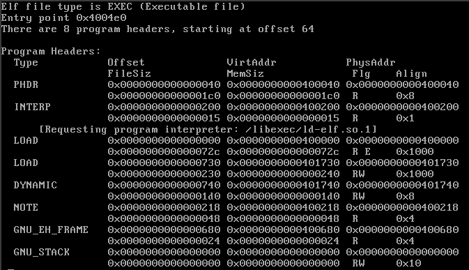
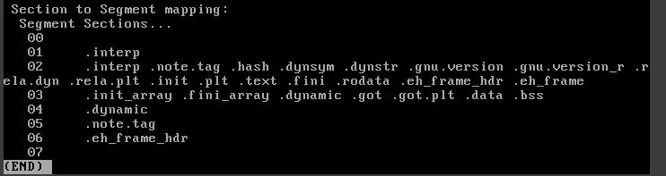
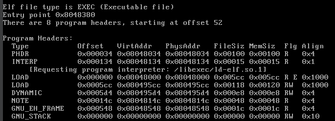
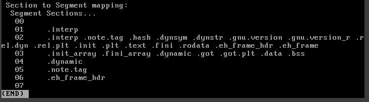
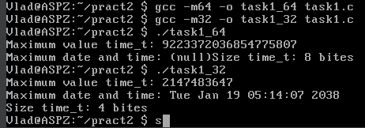

# Завдання 1

## Умова

Необхідно написати програму для визначення моменту, коли `time_t` закінчиться. Програма повинна досліджувати зміни в залежності від 32- та 64-бітної архітектури. Також потрібно дослідити сегменти виконуваного файлу.

## Код програми

```c
#include <stdio.h>
#include <time.h>
#include <limits.h>

int main() {
    // Визначення максимального значення time_t
    time_t max_time = (time_t)~((time_t)1 << (sizeof(time_t) * 8 - 1));
    printf("Максимальне значення time_t: %lld\n", (long long)max_time);
    
    // Перетворення в людський формат
    printf("Максимальна дата і час: %s", ctime(&max_time));

    // Визначення розміру time_t
    printf("Розмір time_t: %zu байт\n", sizeof(time_t));

    return 0;
}
```

## Пояснення

Програма визначає максимальне значення `time_t` за допомогою операцій з бітами, встановлюючи всі біти крім старшого на одиницю, що дозволяє визначити максимальну дату й час, яку може представляти тип `time_t`. Потім програма виводить це значення у людському форматі та показує розмір типу `time_t` у байтах.

Для компіляції програми в 32-бітному режимі використано тег `-m32`, а для 64-бітного — тег `-m64`. Це дозволяє компілювати програму під різні архітектури. Для аналізу сегментів виконуваного файлу використано команди.

```bash
readelf -l task1_64 | less
```

та

```bash
readelf -l task1_32 | less
```

Команда `less` дозволяє прокручувати виведене у консолі, що зручно для перегляду великих обсягів інформації.

## Результати

### 64-бітна архітектура

Вивід команди `readelf -l task1_64 | less`:




### 32-бітна архітектура

Вивід команди `readelf -l task1_32 | less`:




### Результат виконання програми

Програма виводить максимальне значення `time_t` та відповідну дату й час для обраної архітектури. Для 64-бітної архітектури результат буде більший, оскільки тип `time_t` займає більше байтів.


