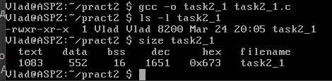

# Завдання 1

## Умова

Необхідно написати програму для визначення моменту, коли `time_t` закінчиться. Програма повинна досліджувати зміни в залежності від 32- та 64-бітної архітектури. Також потрібно дослідити сегменти виконуваного файлу.

## Код програми

```c
#include <stdio.h>
#include <time.h>
#include <limits.h>

int main() {
    // Визначення максимального значення time_t
    time_t max_time = (time_t)~((time_t)1 << (sizeof(time_t) * 8 - 1));
    printf("Максимальне значення time_t: %lld\n", (long long)max_time);
    
    // Перетворення в людський формат
    printf("Максимальна дата і час: %s", ctime(&max_time));

    // Визначення розміру time_t
    printf("Розмір time_t: %zu байт\n", sizeof(time_t));

    return 0;
}
```

## Пояснення

Програма визначає максимальне значення `time_t` за допомогою операцій з бітами, встановлюючи всі біти крім старшого на одиницю, що дозволяє визначити максимальну дату й час, яку може представляти тип `time_t`. Потім програма виводить це значення у людському форматі та показує розмір типу `time_t` у байтах.

## Результат виконання програми

Програма виводить максимальне значення `time_t` та відповідну дату й час для обраної архітектури. Для 64-бітної архітектури результат буде більший, оскільки тип `time_t` займає більше байтів.
Для компіляції програми в 32-бітному режимі використано тег `-m32`, а для 64-бітного — тег `-m64`. Це дозволяє компілювати програму під різні архітектури. Для аналізу сегментів виконуваного файлу використано команди.


## Аналіз сегментів

Для того аби проаналізувати сегменти програми було використано наступні команди:

```bash
readelf -l task1_64 | less
```

та

```bash
readelf -l task1_32 | less
```

Команда `readelf` є утилітою для перегляду інформації про виконувані файли в форматі ELF (Executable and Linkable Format), що використовується в операційних системах Unix-подібного типу (наприклад, Linux). Ключ `-l` вказує на те, що потрібно вивести заголовки сегментів виконуваного файлу.
Таким чином, команда `readelf -l` дозволяє отримати інформацію про те, як виконуваний файл організований і як його сегменти будуть оброблятися під час запуску.

Команда `less` дозволяє прокручувати виведене у консолі, що зручно для перегляду великих обсягів інформації.

## Результати аналізу

### 64-бітна архітектура

Вивід команди `readelf -l task1_64 | less`:


### 32-бітна архітектура

Вивід команди `readelf -l task1_32 | less`:


# Завдання 2.2

## Умова

Розгляньте сегменти у виконуваному файлі.

1. Скомпілюйте програму &quot;hello world&quot;, запустіть ls -l для виконуваного файлу, щоб отримати його загальний розмір, і запустіть size, щоб отримати розміри сегментів всередині нього.

2. Додайте оголошення глобального масиву із 1000 int, перекомпілюйте й повторіть вимірювання. Зверніть увагу на відмінності.

3. Тепер додайте початкове значення в оголошення масиву (пам’ятайте, що C не змушує вас вказувати значення для кожного елемента масиву в ініціалізаторі). Це перемістить масив із сегмента BSS у сегмент даних. Повторіть вимірювання. Зверніть увагу на різницю.

4. Тепер додайте оголошення великого масиву в локальну функцію. Оголосіть другий великий локальний масив з ініціалізатором. Повторіть вимірювання. Дані розташовуються всередині функцій, залишаючись у виконуваному файлі? Яка різниця, якщо масив ініціалізований чи ні?

5. Які зміни відбуваються з розмірами файлів і сегментів, якщо ви компілюєте для налагодження? Для максимальної оптимізації?

## Код до пункту 1

```с
#include <stdio.h>

int main() {
    printf("Hello, World!\n");
    return 0;
}
```

## Пояснення до пункту 1

За допомогою команд 

```bash
gcc -o task2_1 task2_1.c
ls -l task2_1        # Перевіряємо загальний розмір файлу
size task2_1         # Перевіряємо розмір сегментів
```

отримуємо загальний розмір і розміри сегментів всередині виконуваного файлу.


