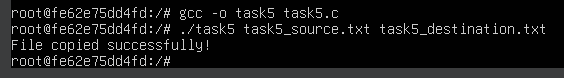

# Завдання 1

## Умова

Запустіть Docker-контейнер і поекспериментуйте з максимальним лімітом ресурсів відкритих файлів. Для цього виконайте команди у вказаному порядку:

```bash
$ ulimit -n
$ ulimit -aS | grep "open files"
$ ulimit -aH | grep "open files"
$ ulimit -n 3000
$ ulimit -aS | grep "open files"
$ ulimit -aH | grep "open files"
$ ulimit -n 3001
$ ulimit -n 2000
$ ulimit -n
$ ulimit -aS | grep "open files"
$ ulimit -aH | grep "open files"
$ ulimit -n 3000
```

Як наступне вправу, повторіть перераховані команди з root-правами.

## Виконання

Для початку запустимо контейнер. Для цього завантажимо `Docker` та підключимо посилання для образів. Тепер пропишемо команду для запуску контейнера:

```bash
docker run -it --rm ubuntu bash
```

Після того як контейнер запустився, вводимо по черзі надані команди.

### Результат введення команд


Як ми бачимо, зі звичайними правами ми можемо знижувати ліміт, проте підвищувати - ні.

Тепер повторимо виконані дії з `root`-правами. Для цього вийдемо з першого контейнера командою `exit`, та запустимо новий контейнер:

```bash
docker run -it --rm --privileged ubuntu bash
```

Тепер вводимо дані команди.

### Результат введення команд з root-правами


Як ми бачимо, з `root`-правами ми можемо не тільки знижувати а й підвищувати ліміт. Для закриття контейнера використаємо команду `exit`.

# Завдання 2

## Умова

У Docker-контейнері встановіть утиліту perf(1). Поекспериментуйте з досягненням процесом встановленого ліміту.

## Пояснення

### Скрипт

```bash
#!/bin/bash

counter=0
while true; do
sleep 2 &
counter=$((counter + 1))
echo "Created $counter processes"

done

```

Спочатку встановлюємо сам `perf`:

```bash
apt install -y linux-tools-common linux-tools-generic linux-tools-$(uname -r)
```

Потім потрібно написати скрипт у файл `task2.sh`. Скрипт нескінченно створює нові фонові процеси, кожен з яких буде чекати 2 секунди перед завершенням. Паралельно скрипт виводить, скільки процесів було створено на кожній ітерації. Це може призвести до значного навантаження на систему, оскільки кожні 2 секунди запускаються нові фонові процеси, що, у свою чергу, може призвести до заповнення таблиці процесів і навіть до системного зависання, якщо скрипт не буде зупинений.

Тоді за допомогою команди

```bash
nohup ./task2.sh &
```

запускаємо скрипт у фоновому режимі. Після цього вводимо команду 

```bash
perf top -p $(pgrep -d','-f task2.sh)
```

для перегляду процесів, пов'язаних із запущенною програмою.

### Результат використання команди `perf top`


# Завдання 3

## Умова

Напишіть програму, що імітує кидання шестигранного кубика. Імітуйте кидки, результати записуйте у файл, для якого попередньо встановлено обмеження на його максимальний розмір (max file size). Коректно обробіть ситуацію перевищення ліміту.

## Виконання

### Код програми

```c
#define FILENAME "dice_results.txt"
#define MAX_FILE_SIZE 128

void roll_dice_and_write() {
    FILE *file;
    struct stat file_stat;

    int dice_roll = rand() % 6 + 1;

    if (stat(FILENAME, &file_stat) == 0 && file_stat.st_size >= MAX_FILE_SIZE) {
        printf("File exceeded %d bites, clean it...\n", MAX_FILE_SIZE);
        file = fopen(FILENAME, "w");
    } else {
        file = fopen(FILENAME, "a");
    }

    if (file == NULL) {
        perror("Error: can not open file");
        exit(EXIT_FAILURE);
    }

    fprintf(file, "Rolling: %d\n", dice_roll);
    fclose(file);

    printf("Dice roll: %d (written to file)\n", dice_roll);
}

int main() {
    srand(time(NULL));
    char choice;

    do {
        roll_dice_and_write();
        printf("Throw again? (y/n): ");
        scanf(" %c", &choice);
    } while (choice == 'y' || choice == 'Y');

    printf("The game is over. The results are saved to %s\n", FILENAME);
    return 0;
}
```

Програма імітує кидання шестигранного кубика і записує результати у файл. Вона працює наступним чином: після запуску генерується випадкове число від 1 до 6, яке імітує результат кидка кубика. Кожен результат записується у текстовий файл, що знаходиться в поточній директорії під назвою `dice_results.txt`. Якщо розмір файлу перевищує встановлене обмеження, програма очищає файл і починає записувати нові результати знову.

Програма використовує нескінченний цикл, який генерує новий кидок кубика кожну секунду. Після кожного кидка вона запитує користувача, чи хоче він продовжити гру. Якщо користувач вводить "y" або "Y", програма кидає кубик ще раз. Якщо ж вводиться будь-яка інша літера, програма завершить свою роботу.

### Результат запуску програми


### Файл dice_results.txt після запуску програми


Крім того, програма перевіряє розмір файлу після кожного запису. Якщо розмір файлу досягає встановленого ліміту в 128 байт, програма очищає файл, щоб продовжити запис. Це дозволяє забезпечити, що файл не перевищує заданий розмір і що в ньому завжди буде лише обмежена кількість результатів.

Таким чином, програма надає користувачеві можливість взаємодіяти з нею, вибираючи, скільки разів вона має продовжити кидати кубик, і дозволяє зберігати результати кожного кидка у файлі.

### Результат запуску програми з переповненням 


### Файл dice_results.txt після запуску програми з переповненням


# Завдання 4

## Умова

Напишіть програму, що імітує лотерею, вибираючи 7 різних цілих чисел у діапазоні від 1 до 49 і ще 6 з 36. Встановіть обмеження на час ЦП (max CPU time) і генеруйте результати вибору чисел (7 із 49, 6 із 36). Обробіть ситуацію, коли ліміт ресурсу вичерпано.

## Виконання

### Код програми

```c
#include <stdio.h>
#include <stdlib.h>
#include <time.h>
#include <signal.h>
#include <unistd.h>

#define MAX_TIME 5 // Ліміт часу на виконання (у секундах)
#define LOTTERY_1_SIZE 7
#define LOTTERY_2_SIZE 6

// Обробка сигналу при перевищенні ліміту часу
void handle_alarm(int sig) {
    printf("Execution time has expired. Program is finished.\n");
    exit(1);
}

// Функція для генерації унікальних випадкових чисел
void generate_unique_numbers(int *arr, int size, int min, int max) {
    int i, num, j, unique;

    for (i = 0; i < size; i++) {
        do {
            num = rand() % (max - min + 1) + min;
            unique = 1;
            for (j = 0; j < i; j++) {
                if (arr[j] == num) {
                    unique = 0;
                    break;
                }
            }
        } while (!unique);
        arr[i] = num;
    }
}

// Функція для сортування масиву чисел (для кращої візуалізації)
void sort_numbers(int *arr, int size) {
    int temp, i, j;
    for (i = 0; i < size - 1; i++) {
        for (j = i + 1; j < size; j++) {
            if (arr[i] > arr[j]) {
                temp = arr[i];
                arr[i] = arr[j];
                arr[j] = temp;
            }
        }
    }
}

int main() {
    signal(SIGALRM, handle_alarm);  // Встановлюємо обробник сигналу для обмеження часу
    alarm(MAX_TIME);  // Встановлюємо таймер для сигналу через MAX_TIME секунд

    srand(time(NULL)); // Ініціалізація генератора випадкових чисел

    int lottery_1[LOTTERY_1_SIZE];
    int lottery_2[LOTTERY_2_SIZE];

    // Генерація 7 чисел з діапазону 1-49
    generate_unique_numbers(lottery_1, LOTTERY_1_SIZE, 1, 49);
    // Генерація 6 чисел з діапазону 1-36
    generate_unique_numbers(lottery_2, LOTTERY_2_SIZE, 1, 36);

    // Сортуємо числа для зручності виведення
    sort_numbers(lottery_1, LOTTERY_1_SIZE);
    sort_numbers(lottery_2, LOTTERY_2_SIZE);

    // Виведення результатів
    printf("Lottery result (7 out of 49): ");
    for (int i = 0; i < LOTTERY_1_SIZE; i++) {
        printf("%d ", lottery_1[i]);
    }
    printf("\n");

    printf("Lottery result (6 out of 36): ");
    for (int i = 0; i < LOTTERY_2_SIZE; i++) {
        printf("%d ", lottery_2[i]);
    }
    printf("\n");

    return 0;
}

```

Запускаємо контейнер. Завантажуємо `nano` та `gcc`. Створюємо файл та записуємо у нього код програми. 

Програма імітує розіграш лотереї, у якій випадково вибираються два набори чисел: 7 чисел із діапазону від 1 до 49 та 6 чисел із діапазону від 1 до 36. Вона гарантує, що кожне число у вибраних наборах є унікальним, а перед виведенням результати сортуються для зручності перегляду.

Для роботи програми використовується генератор випадкових чисел `rand()`, ініціалізований поточним часом `(time(NULL))`. Щоб уникнути повторень, під час вибору кожного нового числа перевіряється, чи вже міститься воно у відповідному наборі. Якщо число вже вибране, воно генерується повторно, поки не буде унікальним.

Окрім генерації лотерейних чисел, програма має обмеження на час роботи процесора (CPU time). Це реалізовано через системний таймер `alarm()`, який викликає сигнал `SIGALRM` після перевищення заданого ліміту часу. У даному випадку обмеження становить 5 секунд. Якщо програма не встигає завершити роботу в цей час, обробник сигналу `(handle_alarm())` виводить повідомлення "Час виконання вичерпано. Програма завершена.", після чого виконання припиняється.

Для коректної роботи перед запуском можна встановити обмеження часу процесора через команду `ulimit -t 5`. Це дозволяє програмі завершитися у разі перевищення дозволеного часу виконання. Завдяки такому підходу програма працює ефективно, уникаючи перевантаження системи нескінченними обчисленнями.

Після запуску користувач бачить два набори виграшних чисел, які відображаються у відсортованому вигляді. Якщо ліміт часу вичерпано, програма завершується з відповідним повідомленням.

### Результат виконання програми


# Завдання 5

## Умова

Напишіть програму для копіювання одного іменованого файлу в інший. Імена файлів передаються у вигляді аргументів.

Програма має:
- перевіряти, чи передано два аргументи, інакше виводити "Program need two arguments";
- перевіряти доступність першого файлу для читання, інакше виводити "Cannot open file .... for reading";
- перевіряти доступність другого файлу для запису, інакше виводити "Cannot open file .... for writing";
- обробляти ситуацію перевищення обмеження на розмір файлу.


## Виконання

### Код програми

```c
#include <stdio.h>
#include <stdlib.h>
#include <sys/stat.h>
#include <unistd.h>
#include <fcntl.h>

#define MAX_FILE_SIZE 1048576 // Максимальний розмір файлу (1 МБ)

int main(int argc, char *argv[]) {
    if (argc != 3) {
        printf("Program need two arguments\n");
        return 1;
    }

    const char *source_file = argv[1];
    const char *dest_file = argv[2];

    struct stat file_stat;
    if (stat(source_file, &file_stat) != 0) {
        printf("Cannot open file %s for reading\n", source_file);
        return 1;
    }

    if (file_stat.st_size > MAX_FILE_SIZE) {
        printf("File %s exceeds the maximum allowed size\n", source_file);
        return 1;
    }

    FILE *src = fopen(source_file, "rb");
    if (!src) {
        printf("Cannot open file %s for reading\n", source_file);
        return 1;
    }

    FILE *dest = fopen(dest_file, "wb");
    if (!dest) {
        printf("Cannot open file %s for writing\n", dest_file);
        fclose(src);
        return 1;
    }

    char buffer[4096];
    size_t bytes;
    while ((bytes = fread(buffer, 1, sizeof(buffer), src)) > 0) {
        if (fwrite(buffer, 1, bytes, dest) != bytes) {
            printf("Error writing to file %s\n", dest_file);
            fclose(src);
            fclose(dest);
            return 1;
        }
    }

    fclose(src);
    fclose(dest);
    printf("File copied successfully!\n");
    return 0;
}
```

Програма копіює вміст одного файлу в інший, виконуючи необхідні перевірки. Спочатку вона перевіряє, чи було передано рівно два аргументи — імена вхідного та вихідного файлів. Якщо аргументів недостатньо або занадто багато, виводиться повідомлення "Program need two arguments", і програма завершується. Далі вона перевіряє доступність вихідного файлу для читання за допомогою stat(). Якщо файл не існує або недоступний, виводиться повідомлення "Cannot open file ... for reading".

Перед початком копіювання програма також перевіряє розмір вихідного файлу. Якщо його розмір перевищує встановлений ліміт (1 МБ), виводиться повідомлення "File ... exceeds the maximum allowed size", і програма завершує роботу. Далі здійснюється перевірка можливості запису у вихідний файл, використовуючи fopen(). Якщо файл не вдається відкрити для запису, програма повідомляє про це рядком "Cannot open file ... for writing", закриває відкриті файли (якщо потрібно) і припиняє виконання.

Якщо всі перевірки пройдено успішно, починається процес копіювання. Вхідний файл читається блоками по 4096 байтів, які записуються у вихідний файл. Якщо під час запису виникає помилка, програма виводить "Error writing to file ...", закриває файли та завершує роботу. Якщо копіювання завершилося без помилок, файли закриваються, і програма виводить повідомлення "File copied successfully!".

### Вхідний файл


### Результат виконання програми



### Вихідний файл


# Завдання 6

## Умова

Напишіть програму, що демонструє використання обмеження (max stack segment size). Підказка: рекурсивна програма активно використовує стек.

## Виконання

# Завдання 7 (варіант 20)

## Умова

Написати програму, яка тестує вплив ulimit -r на пріоритети процесів.

## Виконання
