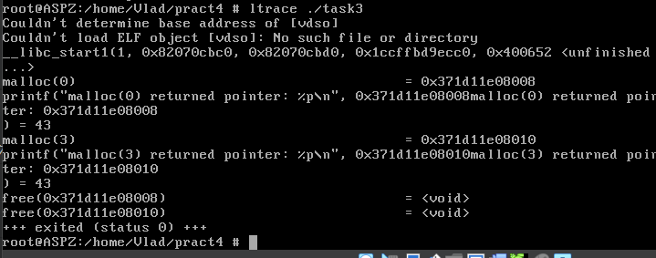
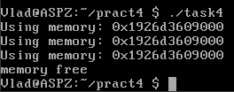
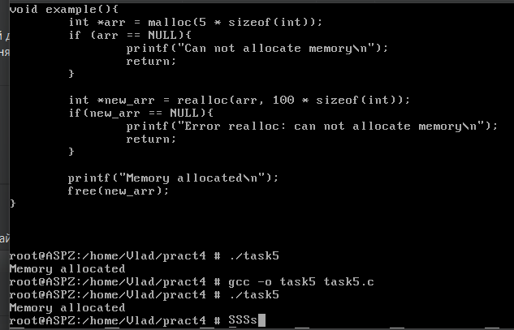
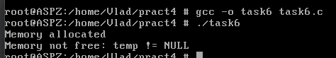

# Завдання 1

## Умова

Скільки пам’яті може виділити malloc(3) за один виклик?
Параметр malloc(3) є цілим числом типу даних size_t, тому логічно максимальне число, яке можна передати як параметр malloc(3), — це максимальне значення size_t на платформі (sizeof(size_t)). У 64-бітній Linux size_t становить 8 байтів, тобто 8 * 8 = 64 біти. Відповідно, максимальний обсяг пам’яті, який може бути виділений за один виклик malloc(3), дорівнює 2^64. Спробуйте запустити код на x86_64 та x86. Чому теоретично максимальний обсяг складає 8 ексабайт, а не 16?

## Пояснення

Теоретично максимальний обсяг пам’яті, який можна передати malloc(3), визначається максимально можливим значенням типу size_t.

Для 64-бітної системи (x86_64) size_t має розмір 8 байтів (64 біти), тобто максимальне значення size_t — це 2^64 -1. Однак у реальних умовах система не виділить 16 ексабайт (максимум для 64-бітного числа), через обмеження фізичної пам’яті, віртуальної пам’яті, а також через особливості самого malloc(3).

Чому не 16 ексабайт, а 8?
Архітектура x86_64 використовує канонічні адреси. Поточні 64-бітні процесори не використовують всі 64 біти для адресації. У більшості сучасних CPU використовується 48 або 57 біт для адрес, а решта бітів повинні бути або всі 0, або всі 1. Якщо використовується 48-бітна адресація, доступна область пам’яті — 256 ТБ (2⁴⁸ байт), а не повні 16 ЕБ. Якщо використовується 57-бітна адресація, то це 128 ПБ (2⁵⁷ байт).

Операційна система (наприклад, FreeBSD або Linux) додатково обмежує доступний простір для malloc(3), враховуючи віртуальний адресний простір процеса, налаштування ліміту ulimit -v та фізичну пам’ять і swap.

На 32-бітній системі (x86) size_t має розмір 4 байти (32 біти), отже, максимально можливе значення: 2^32 - 1 = 4,294,967,295(близько 4ГБ). Проте на багатьох 32-бітних ОС (FreeBSD, Linux) користувацькому процесу зазвичай доступно тільки 3 ГБ, оскільки 1 ГБ зарезервований для ядра.

## Висновок
Теоретичний максимум malloc(3) визначається size_t. Реальний максимум залежить від архітектури CPU, підтримки ОС та обмежень віртуальної пам’яті. У x86_64 адресація часто обмежена 48 або 57 бітами, тому доступно не 16 ЕБ, а максимум 8 ЕБ або менше.

# Завдання 2

## Умова

Що станеться, якщо передати malloc(3) від’ємний аргумент? Напишіть тестовий випадок, який обчислює кількість виділених байтів за формулою num = xa * xb. Що буде, якщо num оголошене як цілочисельна змінна зі знаком, а результат множення призведе до переповнення? Як себе поведе malloc(3)? Запустіть програму на x86_64 і x86.

## Виконання

### Код програми коли переповнення спрацювало

```c
#include <stdio.h>
#include <stdlib.h>
#include <limits.h>

int main() {
    // Визначимо два числа для множення
    int xa = 2;
    int xb = MAX_INT;
    
    int num = xa * xb;
    
    // Перевіряємо на переповнення
    if (num < 0) {
        printf("Owerflow completed\n");
    } else {
        printf("Number of bites for malloc: %d\n", num);
        
        void* ptr = malloc(num);
        
        if (ptr == NULL) {
            printf("Can not allocate memory\n");
        } else {
            printf("Memory allocated\n");
            free(ptr);
        }
    }

    return 0;
}
```

### Код програми коли "переповнення не спрацювало"

```c
#include <stdio.h>
#include <stdlib.h>
#include <limits.h>

int main() {
    // Визначимо два числа для множення
    int xa = 3;
    int xb = MAX_INT;
    
    int num = xa * xb;
    
    // Перевіряємо на переповнення
    if (num < 0) {
        printf("Owerflow completed\n");
    } else {
        printf("Number of bites for malloc: %d\n", num);
        
        void* ptr = malloc(num);
        
        if (ptr == NULL) {
            printf("Can not allocate memory\n");
        } else {
            printf("Memory allocated\n");
            free(ptr);
        }
    }

    return 0;
}
```

### Пояснення

У першій програмі максимальне значення `int` множиться на 2. В такому випадку отримуємо `Owerflow completed`. Якщо заглянути під капот, то ми дізнаємось що при множенні `MAX_INT` на 2 ми отримуємо від'ємне значення. Тобто сталась непередбачувана поведінка під час переповнення для 32- та 64-бітної архітектури.

### Результат запуску програми з переповненням


Проте, є і інша версія програми. У ній `MAX_INT` множиться на 3. Здавалось би, має також статись переповнення, але у результаті програма спрацьовує успішно, бо через фактичне переповнення і непередбачувану поведінку у змінній `num` ми отримуємо значення, що не перевищує ліміт типу `int`. Проте у версії для 32 біт пам'ять не вдається виділити. На 64-бітній системі якщо переповнення дало позитивний результат (наприклад, через двійкову арифметику), `malloc(3)` отримає додатне значення в межах `INT_MAX`, і спробує виділити пам’ять. На 32-бітній системі `int` залишається 32-бітним, і переповнення також відбувається, проте в результаті `malloc(3)` отримує велике число, що може перевищувати доступний простір пам’яті в 32-бітному адресному просторі, тому операційна система не може виділити такий обсяг, і `malloc(3)` повертає `NULL`.

### Результат запуску програми "без переповнення"


### Відповідь на питання

Що станеться, якщо передати `malloc(3)` від'ємний аргумент? - Функція malloc(3) приймає значення типу size_t, яке є беззнаковим цілим числом. Якщо передати malloc(3) від’ємний аргумент (тобто значення зі знаком, яке інтерпретується як беззнакове), воно буде неявно приведене до типу size_t. У такому випадку від’ємне значення буде трактуватися як дуже велике позитивне число, що, ймовірно, призведе до помилки виділення пам’яті (повернення NULL).

# Завдання 3

## Умова

Що станеться, якщо використати malloc(0)? Напишіть тестовий випадок, у якому malloc(3) повертає NULL або вказівник, що не є NULL, і який можна передати у free(). Відкомпілюйте та запустіть через ltrace. Поясніть поведінку програми.

## Виконання

### Код програми 

```c
#include <stdio.h>
#include <stdlib.h>

int main() {
    // Викликаємо malloc(0)
    void* ptr0 = malloc(0);
    
    // Перевіряємо, чи malloc(0) повертає NULL або вказівник
    if (ptr0 == NULL) {
        printf("malloc(0) повернув NULL\n");
    } else {
        printf("malloc(0) повернув вказівник: %p\n", ptr0);
    }

    // Викликаємо malloc(3), що має виділити 3 байти
    void* ptr3 = malloc(3);
    
    // Перевіряємо, чи malloc(3) повернув вказівник на пам'ять
    if (ptr3 == NULL) {
        printf("malloc(3) повернув NULL\n");
    } else {
        printf("malloc(3) повернув вказівник: %p\n", ptr3);
    }

    // Викликаємо free на ptr0 та ptr3, навіть якщо ptr0 може бути NULL
    free(ptr0);
    free(ptr3);

    return 0;
}
```

### Пояснення

З теоретичної точки зору `malloc(0)` має повернути `NULL`. Ніяких проблем з цим не буде, функція `free()` спокійно усе очистить в кінці програми. `malloc(3)` поверне вказівник на 3 байти пам'яті.

### Результат запуску програми



У результаті ми отримали попередження про `vdso`. Це повідомлення не є критичною помилкою. Воно означає, що `ltrace` не зміг визначити адресу vdso (Virtual Dynamically Shared Object), який використовується для швидкого доступу до певних системних викликів. Однак це не впливає на трасування `malloc` і `free`, тому його можна ігнорувати.

Виклик `malloc(0)` не повернув `NULL`, а видав вказівник `0x371d11e08008`. Це очікувана поведінка в деяких реалізаціях `malloc`, зокрема у `glibc`: якщо запросити 0 байт, `malloc(0)` може повернути не `NULL`, але цей вказівник не можна використовувати для запису. `free()` можна викликати для `malloc(0)`, навіть якщо він повертає непорожній результат. 

Виклик malloc(3) дає запит на 3 байти пам'яті. Виділена пам’ять починається з адреси `0x371d11e08010`, що відрізняється від попередньої (виділеної `malloc(0)`). Це означає, що `malloc` успішно виділив пам’ять для використання.

`free(0x371d11e08008)` — ми звільняємо пам'ять, яку виділило `malloc(0)`, навіть якщо вона мала 0 байтів. Це безпечно, оскільки `free(NULL)` або `free()` для `malloc(0)` не призводить до помилки. `free(0x371d11e08010)` — звільняємо пам'ять, виділену `malloc(3)`, що також працює без проблем.

# Завдання 4

## Умова

Чи є помилки у такому коді?

```c
void *ptr = NULL;
while (<some-condition-is-true>) {
    if (!ptr)
        ptr = malloc(n);
    [... <використання 'ptr'> ...]
    free(ptr);
}
```

Напишіть тестовий випадок, який продемонструє проблему та правильний варіант коду.

## Виконання

### Виправлений код

```c
#include <stdio.h>
#include <stdlib.h>

void example() {
    void *ptr = NULL;
    int n = 10;

    // Імітуємо деякі умови для циклу
    for (int i = 0; i < 3; i++) {
        if (!ptr)
            ptr = malloc(n);  // Виділяємо пам'ять
        if (ptr == NULL) {
            printf("Не вдалося виділити пам'ять!\n");
            return;
        }
        printf("Використовуємо пам'ять: %p\n", ptr);
        
        // Використовуємо пам'ять ptr
    }

    // Тепер можна звільнити пам'ять після завершення використання
    free(ptr);
    printf("Пам'ять звільнена.\n");
}

int main() {
    example();
    return 0;
}
```

E наданому коді наявне використання `free(ptr)` після кожного циклу. Якщо в циклі змінюється вміст `ptr`, і викликається `free(ptr)` на кожному кроці, це може призвести до використання вже звільненої пам'яті, що є дуже небезпечним. Можна звільнити пам'ять лише після завершення використання цієї пам'яті в циклі, якщо потрібно.
Цей код викликає `free(ptr)` в середині циклу, що призводить до помилок при наступних спробах доступу до звільненої пам'яті.

Замість того, щоб звільняти пам'ять кожного разу в циклі, можна перенести виклик `free(ptr)` після завершення всіх операцій. Таким чином пам'ять звільняється тільки один раз після завершення циклу, що запобігає доступу до звільненої пам'яті.

### Результат виконання програми



# Завдання 5

## Умова

Що станеться, якщо realloc(3) не зможе виділити пам’ять? Напишіть тестовий випадок, що демонструє цей сценарій.

## Виконання

### Код програми

```c
#include <stdio.h>
#include <stdlib.h>

void example() {
    int *arr = malloc(5 * sizeof(int));  // Спочатку виділяємо пам'ять
    if (arr == NULL) {
        printf("Не вдалося виділити пам'ять!\n");
        return;
    }

    // Імітуємо ситуацію, де realloc не може виділити пам'ять
    int *new_arr = realloc(arr, 1000000000 * sizeof(int));  // Спробуємо виділити занадто багато пам'яті
    if (new_arr == NULL) {
        printf("Помилка realloc: не вдалося виділити пам'ять\n");
        free(arr);  // Звільняємо стару пам'ять
        return;
    }

    // Якщо realloc успішний
    printf("Пам'ять успішно перевиділено\n");

    free(new_arr);  // Звільняємо пам'ять
}

int main() {
    example();
    return 0;
}
```

### Пояснення

Функція `realloc(ptr, new_size)` призначена для зміни розміру блоку пам'яті, на який вказує `ptr`, до нового розміру `new_size`. Якщо новий розмір більший за попередній, то функція може перемістити пам'ять в інше місце віртуальної пам'яті. Якщо пам'ять не можна перевиділити (наприклад, через відсутність доступної пам'яті), функція повертає `NULL`. У разі успіху повертається новий вказівник на пам'ять.

### Результат виконання програми



У сучасних операційних системах, таких як Linux та FreeBSD, зазвичай використовується механізм `lazy allocation` (відкладене виділення пам'яті). Це означає, що система може виділяти віртуальну пам'ять для процесу без негайного виділення фізичної пам'яті. Пам'ять насправді не буде резервуватися до того моменту, поки процес не звернеться до неї (наприклад, при записі в масив). Тому навіть якщо realloc повертає новий вказівник, це не означає, що фізична пам'ять виділена. Операційна система може зробити це пізніше, коли процес спробує записати в цю пам'ять.

# Завдання 6

## Умова

Якщо realloc(3) викликати з NULL або розміром 0, що станеться? Напишіть тестовий випадок.

## Виконання

### Код програми

```c
#include <stdio.h>
#include <stdlib.h>

int main() {
    // Викликаємо realloc з NULL (еквівалентно malloc)
    int *ptr = realloc(NULL, 5 * sizeof(int));
    if (ptr == NULL) {
        printf("Не вдалося виділити пам'ять.\n");
        return 1;
    } else {
        printf("Пам'ять виділена успішно для 5 елементів.\n");
    }

    // Викликаємо realloc з розміром 0 (еквівалентно free)
    int *temp = realloc(ptr, 0);
    if (temp == NULL) {
        printf("Пам'ять успішно звільнена (temp == NULL).\n");
    } else {
        printf("Пам'ять не звільнена, temp != NULL.\n");
        // За допомогою temp перевірте, чи вона була перепризначена
        free(temp);  // Важливо: звільніть пам'ять після перевірки
    }

    return 0;
}
```

### Пояснення

Якщо викликати `realloc` з аргументом `NULL`, то це буде еквівалентно виклику `malloc`, тобто виділення нової пам'яті. Якщо ж розмір для `realloc` вказати як 0, то це еквівалентно виклику `free`, і пам'ять буде звільнена.

Виклик `realloc(ptr, 0)` фактично звільняє пам'ять, на яку вказує ptr. Це стандартна поведінка `realloc`, коли передається вказівник 0. Але, оскільки повертається новий вказівник, поведінка залежить від конкретної реалізації бібліотеки. У більшості випадків вказівник на звільнену пам'ять (якщо він не був перепризначений) залишається на тому самому місці і може бути не `NULL`. Тобто, можна отримати старий вказівник на звільнену пам'ять.

### Результат роботи програми


