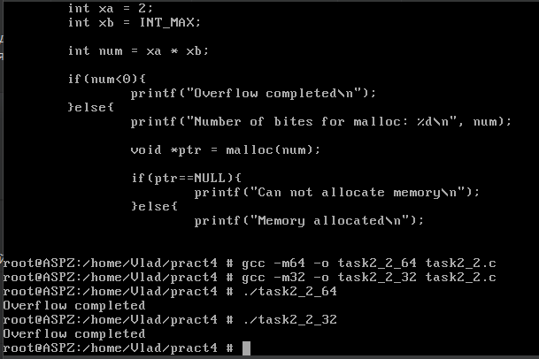
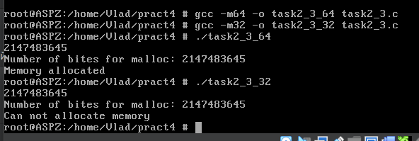

# Завдання 1

## Умова

Скільки пам’яті може виділити malloc(3) за один виклик?
Параметр malloc(3) є цілим числом типу даних size_t, тому логічно максимальне число, яке можна передати як параметр malloc(3), — це максимальне значення size_t на платформі (sizeof(size_t)). У 64-бітній Linux size_t становить 8 байтів, тобто 8 * 8 = 64 біти. Відповідно, максимальний обсяг пам’яті, який може бути виділений за один виклик malloc(3), дорівнює 2^64. Спробуйте запустити код на x86_64 та x86. Чому теоретично максимальний обсяг складає 8 ексабайт, а не 16?

## Пояснення

Теоретично максимальний обсяг пам’яті, який можна передати malloc(3), визначається максимально можливим значенням типу size_t.

Для 64-бітної системи (x86_64) size_t має розмір 8 байтів (64 біти), тобто максимальне значення size_t — це 2^64 -1. Однак у реальних умовах система не виділить 16 ексабайт (максимум для 64-бітного числа), через обмеження фізичної пам’яті, віртуальної пам’яті, а також через особливості самого malloc(3).

Чому не 16 ексабайт, а 8?
Архітектура x86_64 використовує канонічні адреси. Поточні 64-бітні процесори не використовують всі 64 біти для адресації. У більшості сучасних CPU використовується 48 або 57 біт для адрес, а решта бітів повинні бути або всі 0, або всі 1. Якщо використовується 48-бітна адресація, доступна область пам’яті — 256 ТБ (2⁴⁸ байт), а не повні 16 ЕБ. Якщо використовується 57-бітна адресація, то це 128 ПБ (2⁵⁷ байт).

Операційна система (наприклад, FreeBSD або Linux) додатково обмежує доступний простір для malloc(3), враховуючи віртуальний адресний простір процеса, налаштування ліміту ulimit -v та фізичну пам’ять і swap.

На 32-бітній системі (x86) size_t має розмір 4 байти (32 біти), отже, максимально можливе значення: 2^32 - 1 = 4,294,967,295(близько 4ГБ). Проте на багатьох 32-бітних ОС (FreeBSD, Linux) користувацькому процесу зазвичай доступно тільки 3 ГБ, оскільки 1 ГБ зарезервований для ядра.

## Висновок
Теоретичний максимум malloc(3) визначається size_t. Реальний максимум залежить від архітектури CPU, підтримки ОС та обмежень віртуальної пам’яті. У x86_64 адресація часто обмежена 48 або 57 бітами, тому доступно не 16 ЕБ, а максимум 8 ЕБ або менше.

# Завдання 2

## Умова

Що станеться, якщо передати malloc(3) від’ємний аргумент? Напишіть тестовий випадок, який обчислює кількість виділених байтів за формулою num = xa * xb. Що буде, якщо num оголошене як цілочисельна змінна зі знаком, а результат множення призведе до переповнення? Як себе поведе malloc(3)? Запустіть програму на x86_64 і x86.

## Виконання

### Код програми коли переповнення спрацювало

```c
#include <stdio.h>
#include <stdlib.h>
#include <limits.h>

int main() {
    // Визначимо два числа для множення
    int xa = 2;
    int xb = MAX_INT;
    
    int num = xa * xb;
    
    // Перевіряємо на переповнення
    if (num < 0) {
        printf("Owerflow completed\n");
    } else {
        printf("Number of bites for malloc: %d\n", num);
        
        void* ptr = malloc(num);
        
        if (ptr == NULL) {
            printf("Can not allocate memory\n");
        } else {
            printf("Memory allocated\n");
            free(ptr);
        }
    }

    return 0;
}
```

### Код програми коли "переповнення не спрацювало"

```c
#include <stdio.h>
#include <stdlib.h>
#include <limits.h>

int main() {
    // Визначимо два числа для множення
    int xa = 3;
    int xb = MAX_INT;
    
    int num = xa * xb;
    
    // Перевіряємо на переповнення
    if (num < 0) {
        printf("Owerflow completed\n");
    } else {
        printf("Number of bites for malloc: %d\n", num);
        
        void* ptr = malloc(num);
        
        if (ptr == NULL) {
            printf("Can not allocate memory\n");
        } else {
            printf("Memory allocated\n");
            free(ptr);
        }
    }

    return 0;
}
```

### Пояснення

У першій програмі максимальне значення `int` множиться на 2. В такому випадку отримуємо `Owerflow completed`. Якщо заглянути під капот, то ми дізнаємось що при множенні `MAX_INT` на 2 ми отримуємо від'ємне значення. Тобто сталась непередбачувана поведінка під час переповнення для 32- та 64-бітної архітектури.

### Результат запуску програми з переповненням



Проте, є і інша версія програми. У ній `MAX_INT` множиться на 3. Здавалось би, має також статись переповнення, але у результаті програма спрацьовує успішно, бо через фактичне переповнення і непередбачувану поведінку у змінній `num` ми отримуємо значення, що не перевищує ліміт типу `int`. Проте у версії для 32 біт пам'ять не вдається виділити. На 64-бітній системі якщо переповнення дало позитивний результат (наприклад, через двійкову арифметику), `malloc(3)` отримає додатне значення в межах `INT_MAX`, і спробує виділити пам’ять. На 32-бітній системі `int` залишається 32-бітним, і переповнення також відбувається, проте в результаті `malloc(3)` отримує велике число, що може перевищувати доступний простір пам’яті в 32-бітному адресному просторі, тому операційна система не може виділити такий обсяг, і `malloc(3)` повертає `NULL`.

### Результат запуску програми "без переповнення"



### Відповідь на питання

Що станеться, якщо передати `malloc(3)` від'ємний аргумент? - Функція malloc(3) приймає значення типу size_t, яке є беззнаковим цілим числом. Якщо передати malloc(3) від’ємний аргумент (тобто значення зі знаком, яке інтерпретується як беззнакове), воно буде неявно приведене до типу size_t. У такому випадку від’ємне значення буде трактуватися як дуже велике позитивне число, що, ймовірно, призведе до помилки виділення пам’яті (повернення NULL).

# Завдання 3

## Умова

Що станеться, якщо використати malloc(0)? Напишіть тестовий випадок, у якому malloc(3) повертає NULL або вказівник, що не є NULL, і який можна передати у free(). Відкомпілюйте та запустіть через ltrace. Поясніть поведінку програми.

## Виконання

### Код програми 

'''с
#include <stdio.h>
#include <stdlib.h>

int main() {
    // Викликаємо malloc(0)
    void* ptr0 = malloc(0);
    
    // Перевіряємо, чи malloc(0) повертає NULL або вказівник
    if (ptr0 == NULL) {
        printf("malloc(0) повернув NULL\n");
    } else {
        printf("malloc(0) повернув вказівник: %p\n", ptr0);
    }

    // Викликаємо malloc(3), що має виділити 3 байти
    void* ptr3 = malloc(3);
    
    // Перевіряємо, чи malloc(3) повернув вказівник на пам'ять
    if (ptr3 == NULL) {
        printf("malloc(3) повернув NULL\n");
    } else {
        printf("malloc(3) повернув вказівник: %p\n", ptr3);
    }

    // Викликаємо free на ptr0 та ptr3, навіть якщо ptr0 може бути NULL
    free(ptr0);
    free(ptr3);

    return 0;
}
'''
