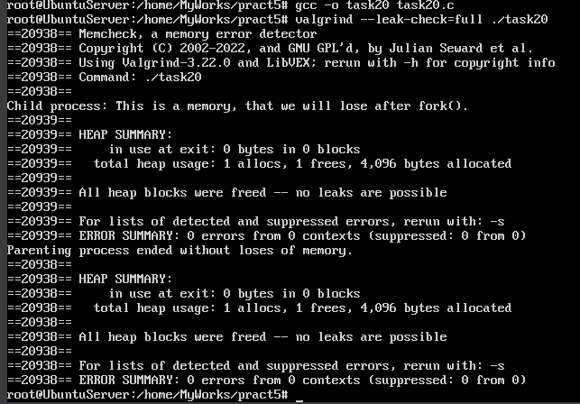

# Завдання 1

## Умова

Побудуйте програму, яка виділяє пам’ять за допомогою mmap() і втрачає її після fork() — без ознак у valgrind.

## Виконання

### [Код програми](task20/task20.c) 

### Пояснення

На початку програми виконується системний виклик fork(), який створює новий (дочірній) процес. Після fork() обидва процеси (батьківський і дочірній) продовжують виконання з наступного рядка, але з різними значеннями, що повертає fork(): у дочірньому процесі pid == 0, у батьківському — pid > 0.

У дочірньому процесі виділяється сторінка пам’яті розміром 4096 байтів за допомогою mmap(), з прапорами MAP_PRIVATE | MAP_ANONYMOUS, що означає, що пам’ять виділяється анонімно (без пов’язування з жодним файлом) і буде копією лише для цього процесу. Після успішного виділення в цю пам’ять записується рядок, і програма виводить його на екран.

Дуже важливим є те, що після завершення дочірнього процесу за допомогою _exit(0) (а не exit(0)), операційна система автоматично звільняє всі ресурси, включаючи пам’ять, виділену через mmap(). Це означає, що пам’ять не потрібно звільняти вручну, і інструменти для перевірки витоків пам’яті (наприклад, valgrind) не виявляють жодних проблем — пам’ять не "втрачається", а належним чином очищується ядром.

У батьківському процесі очікується завершення дочірнього процесу за допомогою wait(NULL), після чого виводиться повідомлення, що процес завершився без витоків пам’яті. Таким чином, програма демонструє коректну модель роботи з пам’яттю, виділеною після fork() у дочірньому процесі, ілюструючи, як можна уникнути витоків навіть без ручного munmap().

### Результат запуску програми

