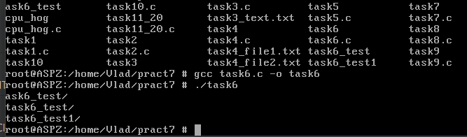

# Завдання 1

## Умова

Використайте popen(), щоб передати вивід команди rwho (команда UNIX) до more (команда UNIX) у програмі на C.

## Виконання

### [Код програми](task1/task1.c) 

### Пояснення

-------------------------

### Результат запуску програми

# Завдання 2

## Умова

Напишіть програму мовою C, яка імітує команду ls -l в UNIX — виводить список усіх файлів у поточному каталозі та перелічує права доступу тощо.
 (Варіант вирішення, що просто виконує ls -l із вашої програми, — не підходить.)

## Виконання

### [Код програми](task2/task2.c) 

### Пояснення

-------------------------

### Результат запуску програми

# Завдання 3

## Умова

Напишіть програму мовою C, яка імітує команду ls -l в UNIX — виводить список усіх файлів у поточному каталозі та перелічує права доступу тощо.
 (Варіант вирішення, що просто виконує ls -l із вашої програми, — не підходить.)

## Виконання

### [Код програми](task3/task3.c)

### [Текстовий файл](task3/task3_text.txt)

### Пояснення

-------------------------

### Результат запуску програми

# Завдання 4

## Умова

Напишіть програму мовою C, яка імітує команду ls -l в UNIX — виводить список усіх файлів у поточному каталозі та перелічує права доступу тощо.
 (Варіант вирішення, що просто виконує ls -l із вашої програми, — не підходить.)

## Виконання

### [Код програми](task4/task4.c) 

### Пояснення

-------------------------

### Результат запуску програми

# Завдання 5

## Умова

Напишіть програму мовою C, яка імітує команду ls -l в UNIX — виводить список усіх файлів у поточному каталозі та перелічує права доступу тощо.
 (Варіант вирішення, що просто виконує ls -l із вашої програми, — не підходить.)

## Виконання

### [Код програми](task5/task5.c) 

### Пояснення

-------------------------

### Результат запуску програми

# Завдання 6

## Умова

Напишіть програму мовою C, яка імітує команду ls -l в UNIX — виводить список усіх файлів у поточному каталозі та перелічує права доступу тощо.
 (Варіант вирішення, що просто виконує ls -l із вашої програми, — не підходить.)

## Виконання

### [Код програми](task6/task6.c) 

### Пояснення

-------------------------

### Результат запуску програми

# Завдання 7

## Умова

Напишіть програму мовою C, яка імітує команду ls -l в UNIX — виводить список усіх файлів у поточному каталозі та перелічує права доступу тощо.
 (Варіант вирішення, що просто виконує ls -l із вашої програми, — не підходить.)

## Виконання

### [Код програми](task7/task7.c) 

### Пояснення

-------------------------

### Результат запуску програми

# Завдання 8

## Умова

Напишіть програму мовою C, яка імітує команду ls -l в UNIX — виводить список усіх файлів у поточному каталозі та перелічує права доступу тощо.
 (Варіант вирішення, що просто виконує ls -l із вашої програми, — не підходить.)

## Виконання

### [Код програми](task8/task8.c) 

### Пояснення

-------------------------

### Результат запуску програми

# Завдання 9

## Умова

Напишіть програму мовою C, яка імітує команду ls -l в UNIX — виводить список усіх файлів у поточному каталозі та перелічує права доступу тощо.
 (Варіант вирішення, що просто виконує ls -l із вашої програми, — не підходить.)

## Виконання

### [Код програми](task9/task9.c) 

### Пояснення

-------------------------

### Результат запуску програми

# Завдання 10

## Умова

Напишіть програму мовою C, яка імітує команду ls -l в UNIX — виводить список усіх файлів у поточному каталозі та перелічує права доступу тощо.
 (Варіант вирішення, що просто виконує ls -l із вашої програми, — не підходить.)

## Виконання

### [Код програми](task10/task10.c) 

### Пояснення

-------------------------

### Результат запуску програми

# Завдання 11 (варіант 20)

## Умова

Напишіть програму мовою C, яка імітує команду ls -l в UNIX — виводить список усіх файлів у поточному каталозі та перелічує права доступу тощо.
 (Варіант вирішення, що просто виконує ls -l із вашої програми, — не підходить.)

## Виконання

### [Код основної програми](task11_20/task11_20.c)

### [Код програми для навантаження CPU](task11_20/task11_20_cpu_hog.c)

### Пояснення

-------------------------

### Результат запуску програми

