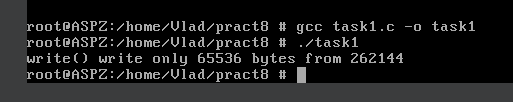
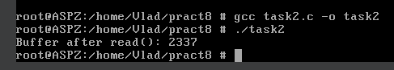
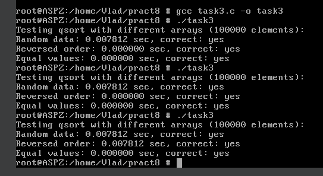
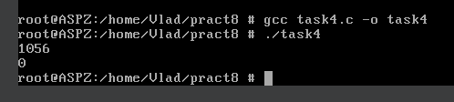
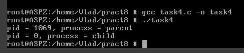
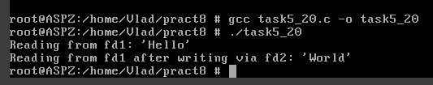
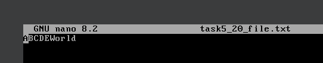

# Завдання 1

## Умова

Чи може виклик count = write(fd, buffer, nbytes); повернути в змінній count значення, відмінне від nbytes? Якщо так, то чому? Наведіть робочий приклад програми, яка демонструє вашу відповідь.

## Виконання

### [Код програми](task1/task1.c) 

### Пояснення

Так, виклик `count = write(fd, buffer, nbytes);` може повернути значення, відмінне від nbytes. Це означає, що запис було виконано лише частково — не вся кількість байтів була фактично передана.

У цій програмі демонструється така ситуація за допомогою неблокуючого каналу (pipe):

Програма створює канал (pipe) і встановлює його кінець для запису в неблокуючий режим за допомогою `fcntl()`. Далі виділяється буфер на 256 КБ і заповнюється символами 'A'. При цьому інший кінець каналу, з якого треба було б зчитувати дані, залишається без обробки, тож буфер каналу поступово заповнюється.

У неблокуючому режимі, коли буфер каналу заповнено, функція `write()` не чекає, поки з'явиться місце — вона повертає одразу, записавши стільки байтів, скільки змогла (іноді навіть 0), або ж взагалі повертає помилку (-1), якщо не вдалося записати нічого. Таким чином, значення `written` буде менше ніж `buffer_size` — саме це демонструє програма.

У таких випадках треба обробляти часткові записи, зазвичай повторюючи `write()` у циклі, допоки не буде записано все.

### Результат запуску програми

# Завдання 2

## Умова

Є файл, дескриптор якого — fd. Файл містить таку послідовність байтів: 4, 5, 2, 2, 3, 3, 7, 9, 1, 5. У програмі виконується наступна послідовність системних викликів:
lseek(fd, 3, SEEK_SET);
read(fd, &buffer, 4);
де виклик lseek переміщує покажчик на третій байт файлу. Що буде містити буфер після завершення виклику read? Наведіть робочий приклад програми, яка демонструє вашу відповідь.

## Виконання

### [Код програми](task2/task2.c) 

### Пояснення

У поданому прикладі програми демонструється використання системних викликів `lseek()` та `read()` для читання з певної позиції файлу. Файл містить 10 байтів зі значеннями:
4, 5, 2, 2, 3, 3, 7, 9, 1, 5. Виклик `lseek(fd, 3, SEEK_SET)` переміщує файловий покажчик на позицію з індексом 3, тобто на четвертий байт. Таким чином, подальший виклик `read(fd, buffer, 4)` читає 4 байти починаючи з індексу 3, тобто: 2, 3, 3, 7. Отже, після виконання `read()`, масив `buffer` міститиме значення: 2, 3, 3, 7.

Програма створює файл, записує в нього задану послідовність байтів, а потім читає 4 байти з позиції 3 і виводить їх. Цей приклад показує як працює `lseek()` і `read()` при позиційному читанні з файлу.

### Результат запуску програми

# Завдання 3

## Умова

Бібліотечна функція qsort призначена для сортування даних будь-якого типу. Для її роботи необхідно підготувати функцію порівняння, яка викликається з qsort кожного разу, коли потрібно порівняти два значення.
Оскільки значення можуть мати будь-який тип, у функцію порівняння передаються два вказівники типу void* на елементи, що порівнюються.
Напишіть програму, яка досліджує, які вхідні дані є найгіршими для алгоритму швидкого сортування. Спробуйте знайти кілька масивів даних, які змушують qsort працювати якнайповільніше. Автоматизуйте процес експериментування так, щоб підбір і аналіз вхідних даних виконувалися самостійно.

Придумайте і реалізуйте набір тестів для перевірки правильності функції qsort.

## Виконання

### [Код програми](task3/task3.c) 

### Пояснення

У цій програмі досліджується ефективність роботи бібліотечної функції `qsort()` для різних типів вхідних даних, щоб з’ясувати, які з них є найгіршими для алгоритму швидкого сортування. Для цього спочатку визначено функцію порівняння цілих чисел, яку передають у `qsort`. Далі реалізовано три типи генераторів масивів: перший створює масив із випадкових значень, другий — масив, відсортований у зворотному порядку, а третій — масив, де всі значення однакові. Програма вимірює час сортування кожного з цих масивів за допомогою `qsort()` і перевіряє, чи дійсно масив відсортований після сортування. У зворотно відсортованому масиві та масиві з однаковими значеннями алгоритм `qsort()` потенційно може працювати повільніше, особливо якщо реалізація вибирає опорний елемент неефективно (у нашому випадку більше всього часу витрачається на масив з випадковими значеннями). Таким чином, програма автоматизує експеримент з підбору найгірших вхідних даних, дозволяючи не лише оцінити продуктивність `qsort`, а й перевірити правильність його роботи на різних наборах даних.

### Результат запуску програми

# Завдання 4

## Умова

Виконайте наступну програму на мові програмування С:
int main() {
  int pid;
  pid = fork();
  printf("%d\n", pid);
}
Завершіть цю програму. Припускаючи, що виклик fork() був успішним, яким може бути результат виконання цієї програми?

## Виконання

### [Код програми](task4/task4.c) 

### Пояснення

У цій програмі використовуємо системний виклик `fork()`, який створює новий процес — дочірній процес. Після успішного виклику `fork()`, обидва процеси (батьківський і дочірній) продовжують виконання з наступного рядка коду після `fork()`.

Як `pid` отримує значення:

- у дочірньому процесі - значення 0;

- у батьківському процесі - PID дочірнього процесу (додатне значення)

- у разі помилки - значення <0.

Якщо `fork()` успішно виконується, програма двічі виконає рядок з `printf`, один раз у батьківському процесі, і один раз у дочірньому(див. "Результат запуску допрацьованої програми").

Порядок цих рядків може змінюватися при кожному запуску, оскільки планувальник операційної системи вирішує, який процес виконується першим. Таким чином, результат залежить від того, хто швидше виведе свій рядок — батько чи дитина.

### Результат запуску програми з умови

### Результат запуску допрацьованої програми

# Завдання 5 (варіант 20)

## Умова

Напишіть програму, яка демонструє неочевидну поведінку при відкритті одного файлу кілька разів з різними прапорами.

## Виконання

### [Код програми](task5_20/task5_20.c) 

### Пояснення

Ця програма демонструє неочевидну поведінку при роботі з одним і тим самим файлом, відкритим кілька разів з різними дескрипторами. У файлі `testfile.txt` спочатку записується рядок `HelloWorld` (10 байт). Потім файл відкривається двічі: перший дескриптор `fd1` — у режимі читання (`O_RDONLY`), другий дескриптор `fd2` — у режимі запису (`O_WRONLY`). Незважаючи на те, що обидва дескриптори посилаються на той самий фізичний файл, вони мають окремі незалежні файлові покажчики позиції, тобто кожен "пам’ятає", на якій позиції він перебуває.

Спочатку через `fd1` читаються 5 байт — зчитується `"Hello"`, і позиція `fd1` зсувається до 5. Потім через `fd2` виконується запис `"ABCDE"` — він починається з початку файлу, бо `fd2` має свою окрему позицію (на початку). Таким чином, замість перших 5 байт у файлі тепер записано `"ABCDE"`.

Після цього через `fd1` читаються наступні 5 байт (позиція вже була на 5-му байті) — зчитується `"World"` з оновленого файлу, тож результатом буде `"World"`.

### Результат запуску програми

### Фінальний файл

