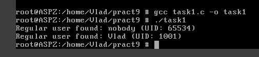
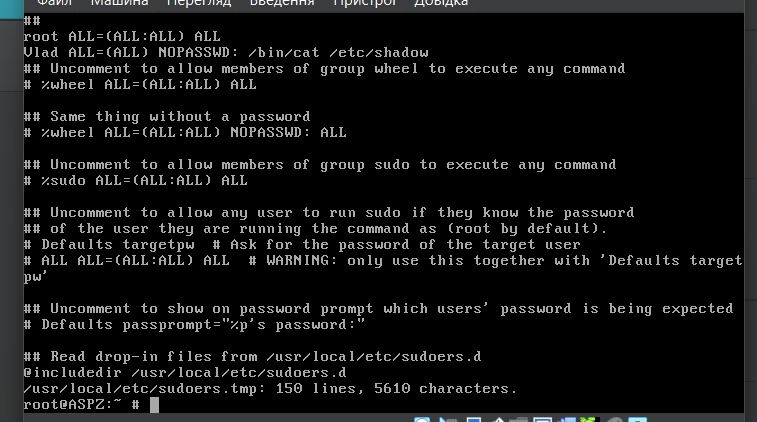
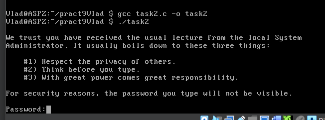
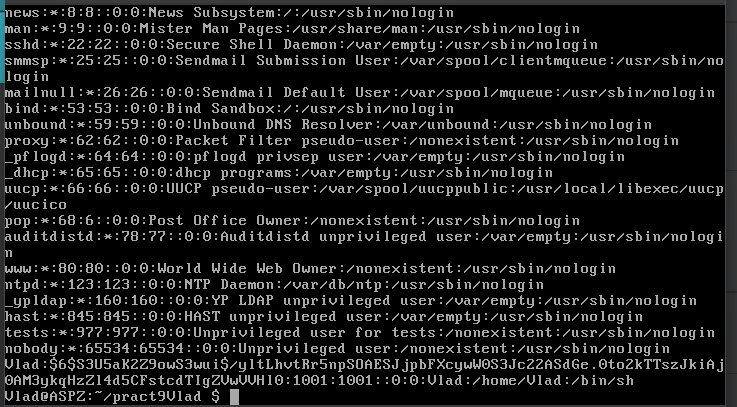
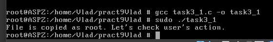
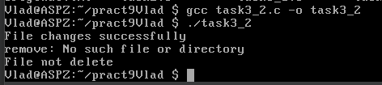
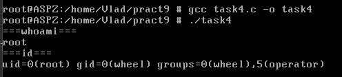
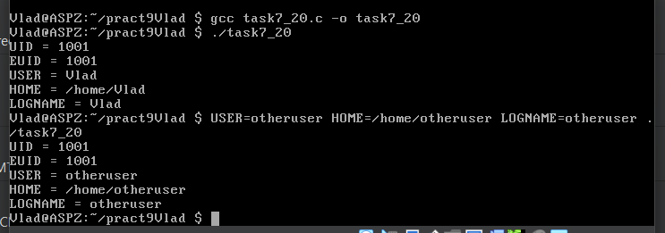

# Завдання 1

## Умова

Напишіть програму, яка читає файл /etc/passwd за допомогою команди getent passwd, щоб дізнатись, які облікові записи визначені на вашому комп’ютері.
Програма повинна визначити, чи є серед них звичайні користувачі (ідентифікатори UID повинні бути більші за 500 або 1000, залежно від вашого дистрибутива), окрім вас.

## Виконання

### [Код програми](task1/task1.c) 

### Пояснення

Ця програма читає список облікових записів користувачів за допомогою команди `getent passwd`, яка витягує інформацію з системної бази користувачів. Вона проходить по кожному рядку, який відповідає одному користувачу, і розбиває його на поля, щоб витягнути ім’я користувача та його UID. Потім програма перевіряє, чи UID користувача перевищує встановлений поріг (1000 — типовий поріг для звичайних користувачів у сучасних дистрибутивах Linux), і чи не збігається UID з UID поточного користувача. Якщо знайдено інших звичайних користувачів, окрім поточного, їх імена та UID виводяться на екран. Якщо ж таких користувачів не знайдено, програма виводить відповідне повідомлення.  

### Результат запуску програми

# Завдання 2

## Умова

Напишіть програму, яка виконує команду cat /etc/shadow від імені адміністратора, хоча запускається від звичайного користувача.
(Ваша програма повинна робити необхідне, виходячи з того, що конфігурація системи дозволяє отримувати адміністративний доступ за допомогою відповідної команди.)

## Виконання

### [Код програми](task2/task2.c) 

### Пояснення

Перед запуском програми із звичайного користувача необхідно з root правами зайти у файл `/usr/local/etc/sudoers` за допомогою команди `visudo`. У пустому рядку прописати `username ALL=(ALL) NOPASSWD: /bin/cat /etc/master.passwd` (аналог `/etc/shadow` в Linux). Скрин файлу `sudoers` трохи застарілий(був змінений після цього), тому тут ще прописано `/etc/shadow`. Ця помилка була виправлена через неіснування такого файлу.

### Файл sudoers

Програма використовує функцію `system()` для виконання команди `sudo /bin/cat /etc/master.passwd`, яка виводить вміст файлу, що зазвичай доступний лише адміністратору. Команда `sudo` дозволяє виконати її з правами суперкористувача, якщо система налаштована таким чином, що користувач має дозвіл на запуск цієї конкретної команди без введення пароля (вище описано як йе зробити через файл `/etc/sudoers`). Якщо виконання команди не вдається, програма виводить повідомлення про помилку.

### Результат запуску програми

# Завдання 3

## Умова

Напишіть програму, яка від імені root копіює файл, який вона перед цим створила від імені звичайного користувача. Потім вона повинна помістити копію у домашній каталог звичайного користувача.
Далі, використовуючи звичайний обліковий запис, програма намагається змінити файл і зберегти зміни. Що відбудеться?
Після цього програма намагається видалити цей файл за допомогою команди rm. Що відбудеться?

## Виконання

### [Код програми 1(запуск з root)](task3/task3_1.c)

### Пояснення програми 1

Опис до першої програми (яка запускається від імені `root`):
Програма формує два шляхи: `original.txt` — файл, який буде створений у домашній директорії звичайного користувача, та `backup.txt` — копія цього файлу. Програма створює файл `original.txt` і записує туди тестовий рядок. Потім вона копіює цей файл у `/tmp/root_copy.txt` вже від імені `root`, змінює власника файлу на `root:wheel` (тобто власником тепер є суперкористувач), і копіює його назад у домашню директорію користувача під назвою `backup.txt`. Таким чином, у домашній папці користувача опиняється файл, що належить `root`.

### Результат запуску програми 1

### [Код програми 2(запуск з користувача)](task3/task3_2.c)

### Пояснення програми 2

Опис до другої програми (яка запускається від імені звичайного користувача):
Програма намагається відкрити файл `backup.txt` у режимі додавання (`a`). Якщо файл належить `root` і користувач не має прав на запис, `fopen` поверне `NULL`, і програма виведе повідомлення про помилку. Якщо ж користувач має права (наприклад, якщо `root` встановив дозвіл на запис для інших), запис буде успішним. Далі програма намагається видалити файл `backup.txt`. Якщо користувач не є власником цього файлу або не має прав на його видалення, команда `remove` завершиться з помилкою. Програма повідомить, що файл не було видалено.

### Результат запуску програми 1

### Висновок

Звичайний користувач не зможе змінити чи видалити файл `backup.txt`, якщо `root` не надав відповідних дозволів. Це демонструє важливість прав доступу та власності у файловій системах UNIX.

# Завдання 4

## Умова

Напишіть програму, яка по черзі виконує команди whoami та id, щоб перевірити стан облікового запису користувача, від імені якого вона запущена.
Є ймовірність, що команда id виведе список різних груп, до яких ви належите. Програма повинна це продемонструвати.

## Виконання

### [Код програми](task4/task4.c) 

### Пояснення

----------------------------------------------- 

### Результат запуску програми

# Завдання 5

## Умова

Напишіть програму, яка створює тимчасовий файл від імені звичайного користувача. Потім від імені суперкористувача використовує команди chown і chmod, щоб змінити тип володіння та права доступу.
Програма повинна визначити, в яких випадках вона може виконувати читання та запис файлу, використовуючи свій обліковий запис.

## Виконання

### [Код програми](task5/task5.c) 

### Пояснення

----------------------------------------------- 

### Результат запуску програми

# Завдання 6

## Умова

Напишіть програму, яка виконує команду ls -l, щоб переглянути власника і права доступу до файлів у своєму домашньому каталозі, в /usr/bin та в /etc.
Продемонструйте, як ваша програма намагається обійти різні власники та права доступу користувачів, а також здійснює спроби читання, запису та виконання цих файлів.

## Виконання

### [Код програми](task6/task6.c) 

### Пояснення

----------------------------------------------- 

### Результат запуску програми

# Завдання 7 (варіант 20)

## Умова

Спробуйте виконати команду як інший користувач, не змінюючи UID.

## Виконання

### [Код програми](task7_20/task7_20.c) 

### Пояснення

----------------------------------------------- 

### Результат запуску програми

