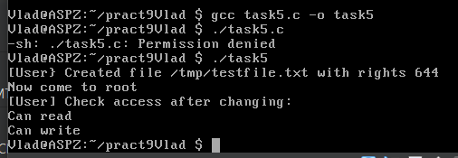
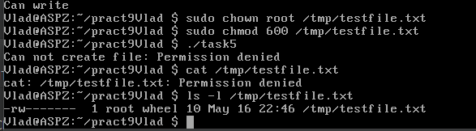
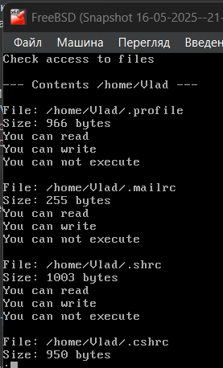
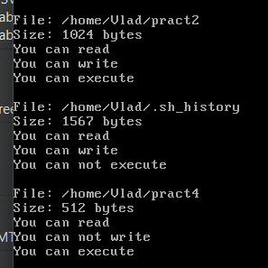
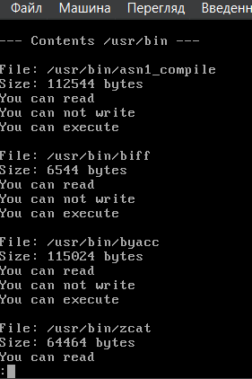
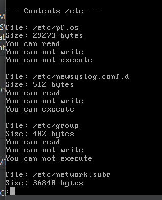

# Завдання 1

## Умова

Напишіть програму, яка читає файл /etc/passwd за допомогою команди getent passwd, щоб дізнатись, які облікові записи визначені на вашому комп’ютері.
Програма повинна визначити, чи є серед них звичайні користувачі (ідентифікатори UID повинні бути більші за 500 або 1000, залежно від вашого дистрибутива), окрім вас.

## Виконання

### [Код програми](task1/task1.c) 

### Пояснення

Ця програма читає список облікових записів користувачів за допомогою команди `getent passwd`, яка витягує інформацію з системної бази користувачів. Вона проходить по кожному рядку, який відповідає одному користувачу, і розбиває його на поля, щоб витягнути ім’я користувача та його UID. Потім програма перевіряє, чи UID користувача перевищує встановлений поріг (1000 — типовий поріг для звичайних користувачів у сучасних дистрибутивах Linux), і чи не збігається UID з UID поточного користувача. Якщо знайдено інших звичайних користувачів, окрім поточного, їх імена та UID виводяться на екран. Якщо ж таких користувачів не знайдено, програма виводить відповідне повідомлення.  

### Результат запуску програми

# Завдання 2

## Умова

Напишіть програму, яка виконує команду cat /etc/shadow від імені адміністратора, хоча запускається від звичайного користувача.
(Ваша програма повинна робити необхідне, виходячи з того, що конфігурація системи дозволяє отримувати адміністративний доступ за допомогою відповідної команди.)

## Виконання

### [Код програми](task2/task2.c) 

### Пояснення

Перед запуском програми із звичайного користувача необхідно з root правами зайти у файл `/usr/local/etc/sudoers` за допомогою команди `visudo`. У пустому рядку прописати `username ALL=(ALL) NOPASSWD: /bin/cat /etc/master.passwd` (аналог `/etc/shadow` в Linux). Скрин файлу `sudoers` трохи застарілий(був змінений після цього), тому тут ще прописано `/etc/shadow`. Ця помилка була виправлена через неіснування такого файлу.

### Файл sudoers

Програма використовує функцію `system()` для виконання команди `sudo /bin/cat /etc/master.passwd`, яка виводить вміст файлу, що зазвичай доступний лише адміністратору. Команда `sudo` дозволяє виконати її з правами суперкористувача, якщо система налаштована таким чином, що користувач має дозвіл на запуск цієї конкретної команди без введення пароля (вище описано як йе зробити через файл `/etc/sudoers`). Якщо виконання команди не вдається, програма виводить повідомлення про помилку.

### Результат запуску програми

# Завдання 3

## Умова

Напишіть програму, яка від імені root копіює файл, який вона перед цим створила від імені звичайного користувача. Потім вона повинна помістити копію у домашній каталог звичайного користувача.
Далі, використовуючи звичайний обліковий запис, програма намагається змінити файл і зберегти зміни. Що відбудеться?
Після цього програма намагається видалити цей файл за допомогою команди rm. Що відбудеться?

## Виконання

### [Код програми 1(запуск з root)](task3/task3_1.c)

### Пояснення програми 1

Опис до першої програми (яка запускається від імені `root`):
Програма формує два шляхи: `original.txt` — файл, який буде створений у домашній директорії звичайного користувача, та `backup.txt` — копія цього файлу. Програма створює файл `original.txt` і записує туди тестовий рядок. Потім вона копіює цей файл у `/tmp/root_copy.txt` вже від імені `root`, змінює власника файлу на `root:wheel` (тобто власником тепер є суперкористувач), і копіює його назад у домашню директорію користувача під назвою `backup.txt`. Таким чином, у домашній папці користувача опиняється файл, що належить `root`.

### Результат запуску програми 1

________________________________________________________________________________________________

### [Код програми 2(запуск з користувача)](task3/task3_2.c)

### Пояснення програми 2

Опис до другої програми (яка запускається від імені звичайного користувача):
Програма намагається відкрити файл `backup.txt` у режимі додавання (`a`). Якщо файл належить `root` і користувач не має прав на запис, `fopen` поверне `NULL`, і програма виведе повідомлення про помилку. Якщо ж користувач має права (наприклад, якщо `root` встановив дозвіл на запис для інших), запис буде успішним. Далі програма намагається видалити файл `backup.txt`. Якщо користувач не є власником цього файлу або не має прав на його видалення, команда `remove` завершиться з помилкою. Програма повідомить, що файл не було видалено.

### Результат запуску програми 1

### Висновок

Звичайний користувач не зможе змінити чи видалити файл `backup.txt`, якщо `root` не надав відповідних дозволів(у нашому випадку змінити вдалось через наявність прав). Це демонструє важливість прав доступу та власності у файловій системах UNIX.

# Завдання 4

## Умова

Напишіть програму, яка по черзі виконує команди whoami та id, щоб перевірити стан облікового запису користувача, від імені якого вона запущена.
Є ймовірність, що команда id виведе список різних груп, до яких ви належите. Програма повинна це продемонструвати.

## Виконання

### [Код програми](task4/task4.c) 

### Пояснення

Ця програма демонструє, від імені якого користувача вона запущена, а також до яких груп належить цей користувач. Спочатку виконується команда `whoami`, яка виводить лише ім’я поточного користувача, тобто того, під ким реально виконується програма. Наприклад, якщо ви запускаєте програму від звичайного користувача, вона виведе щось на кшталт student, а якщо через sudo, то може вивести root. Це дозволяє перевірити, чи виконується програма від імені потрібного облікового запису.

Далі виконується команда `id`, яка показує ідентифікатор користувача (UID), основну групу (GID), а також список усіх груп, до яких належить користувач. Наприклад, результат може виглядати так: uid=1000(student) gid=1000(student) groups=1000(student),27(sudo),4(adm). Це означає, що користувач має основну групу `student`, а також входить до груп `sudo` і `adm`, що дає йому додаткові права, наприклад, доступ до системного журналу або можливість виконувати команди від імені адміністратора.

Команди `whoami` та `id` виконуються через функцію `system`, яка запускає їх як окремі процеси оболонки. Якщо команда не виконується (наприклад, через відсутність прав), програма виведе повідомлення про помилку.

### Результат запуску програми

# Завдання 5

## Умова

Напишіть програму, яка створює тимчасовий файл від імені звичайного користувача. Потім від імені суперкористувача використовує команди chown і chmod, щоб змінити тип володіння та права доступу.
Програма повинна визначити, в яких випадках вона може виконувати читання та запис файлу, використовуючи свій обліковий запис.

## Виконання

### [Код програми](task5/task5.c) 

### Пояснення

У цьому завданні знову необхідно прописати собі права у файлі `sudoers`. Все аналогічно, тільки у файлі додаємо `username ALL=(ALL) NOPASSWD: /usr/sbin/chown, /bin/chmod`.

Програма демонструє, як змінюються права доступу до файлу в залежності від його власника та встановлених дозволів. Спочатку, коли програма виконується від імені звичайного користувача, вона створює тимчасовий файл `/tmp/testfile.txt` із правами `0644`, тобто — власник має право на читання і запис, а інші користувачі — лише на читання. Після створення програма повідомляє, що файл створено з відповідними правами.

Далі потрібно від імені суперкористувача (`root`), виконати дві команди — змінити власника файлу на `root` за допомогою `sudo chown root /tmp/testfile.txt`, а також обмежити права доступу до 600 (читання і запис лише для власника) командою `sudo chmod 600 /tmp/testfile.txt`.

Після цього пропонується знову запустити програму від імені звичайного користувача, щоб перевірити, чи має він право читати або записувати у файл. Програма використовує системний виклик `access()` для перевірки доступу до файлу на читання (`R_OK`) і запис (`W_OK`).

Якщо права було змінено відповідно до інструкції, файл тепер належить `root`, і має права доступу `600`. Звичайний користувач більше не має жодного доступу до цього файлу, тому повторний запуск програми завершується `Can not read file: Permission denied`, бо звичайний користувач вже не має права відкривати файл для запису(скрин 2 команда `cat /tmp/testfile.txt`), тому відбувається помилка створення/відкриття файлу. На 2 скрині за допомогою команди `ls -l /tmp/testfile.txt` ми бачимо, що тепер власником файлу є `root`.

Таким чином, програма наочно демонструє, як зміна власника файлу та прав доступу впливає на можливість доступу до нього з боку інших користувачів.

### Результат запуску програми до зміни власника

### Результат запуску програми після зміни власника

# Завдання 6

## Умова

Напишіть програму, яка виконує команду ls -l, щоб переглянути власника і права доступу до файлів у своєму домашньому каталозі, в /usr/bin та в /etc.
Продемонструйте, як ваша програма намагається обійти різні власники та права доступу користувачів, а також здійснює спроби читання, запису та виконання цих файлів.

## Виконання

### [Код програми](task6/task6.c) 

### Пояснення

Ця програма демонструє перевірку прав доступу користувача до файлів у трьох каталогах: домашньому каталозі користувача (`$HOME`), системному каталозі виконуваних файлів (`/usr/bin`) та каталозі конфігурацій (`/etc`). Вона відкриває кожен каталог і для кожного файла виводить його шлях, розмір і інформацію про доступ: чи дозволено читання, запис та виконання поточному користувачу(запуск виконувався із звичайного користувача).

Програма виконує обхід кожного каталогу за допомогою `opendir` та `readdir`, будує повний шлях до кожного файлу і отримує його метадані через `stat`. Для перевірки доступу використовується функція `access`, яка визначає, чи має поточний користувач відповідні права на файл (читання, запис, виконання).

Результати можуть виявити різні ситуації:

- У домашньому каталозі користувач зазвичай має повний доступ до своїх файлів.

- У `/usr/bin` користувач зазвичай має дозвіл на читання та виконання, але не на запис (оскільки це системні бінарні файли, що захищені).

- У `/etc` часто дозволено лише читання, а запис — лише для адміністратора (`root`).

Це дозволяє побачити, як права доступу та власники обмежують можливості звичайного користувача щодо взаємодії з системними файлами. Також можна легко відслідкувати, які файли є доступними для запуску або редагування.

Програму можна розширити, наприклад, щоб вона ще й запускала ls -l у кожному каталозі через system(), щоб вивести таблицю прав доступу, власників та груп — для порівняння з перевірками через access(). Якщо потрібно, я можу додати це. 

### Результат запуску програми(каталог `$HOME`)

Деякі файли не можна переписати або запустити із звичайного користувача, оскільки вони є або системними, або були створені із правами `root`. На другому скрині є приклад файлу, який можна читати, редагувати та запустити, Оськільки цей файл було створено звичайним користувачем.

### Результат запуску програми(каталог `/usr/bin`)

### Результат запуску програми(каталог `/etc`)

# Завдання 7 (варіант 20)

## Умова

Спробуйте виконати команду як інший користувач, не змінюючи UID.

## Виконання

### [Код програми](task7_20/task7_20.c) 

### Пояснення

----------------------------------------------- 

### Результат запуску програми

